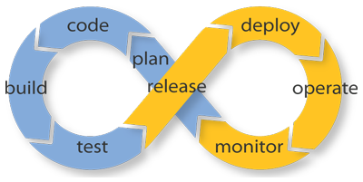
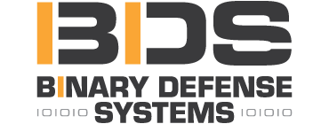
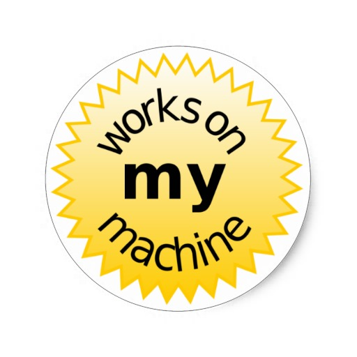
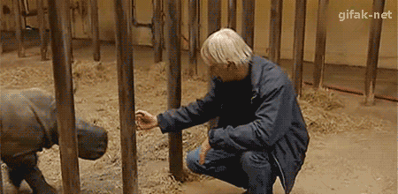
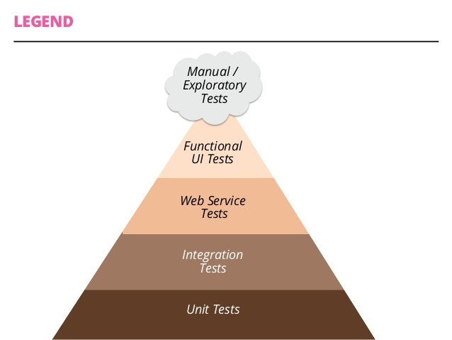

- title : Security Automation in your Continuous Integration Pipeline
- description : Developers use unit tests and acceptances tests in continuous integration (CI) to find bugs early and often in a repeatable way. Security is an important part of any software development life cycle. So why not add security analysis tools to this pipeline? This talk will cover adding and using OWASP/pipeline, a framework made for running security analysis tools in CI.
- author : Jimmy Byrd
- theme : night
- transition : default

***

### Security Automation in your Continuous Integration Pipeline

Jimmy Byrd

https://theangrybyrd.github.io/OWASPPipelineSlides

***

### Jimmy Byrd?
- [@jimmy_byrd](https://twitter.com/Jimmy_Byrd)
- [Github](https://github.com/theangrybyrd)
- Lead Developer at [Binary Defense Systems](https://www.binarydefense.com/)

***

### Continuous what now?

---

### [Continuous Integration](http://martinfowler.com/articles/continuousIntegration.html)

> Continuous Integration is a software development practice where members of a team integrate their work frequently . . . Each integration is verified by an automated build (*including test*) to detect integration errors as quickly as possible. 
> 
> Martin Fowler

---

### Why?

To prevent: 

---

### Continuous Integration 

1. Push
2. Build*
3. Test
4. Report

---

### Merging code

---

    ./build.sh

    ---------------------------------------------------------------------
    Build Report
    ---------------------------------------------------------------------
    Target           Duration
    ------           --------
    RestoreNpm       00:00:32.4737389
    PackWebAssets    00:00:03.7281990
    Linter           00:00:03.3159012
    Compile          00:00:22.2821302
    RunTests         00:00:04.9936549
    ScanCode         00:02:04.0223912
    Status:          Ok 
    ---------------------------------------------------------------------

---

### CI Tools

- [Teamcity](https://www.jetbrains.com/teamcity/)
- [Jenkins](https://jenkins.io/)
- [Gitlab](https://about.gitlab.com/gitlab-ci/)
- [Travis](https://travis-ci.org/)

*** 

### Testing

---

### Security Testing

---

### Automated testing hierarchy

***

### [The Rugged Manifesto](https://www.ruggedsoftware.org/)

I am rugged and, more importantly, my code is rugged.

I recognize that software has become a foundation of our modern world.

I recognize the awesome responsibility that comes with this foundational role.

I recognize that my code will be used in ways I cannot anticipate, in ways it was not designed, and for longer than it was ever intended.

I recognize that my code will be attacked by talented and persistent adversaries who threaten our physical, economic and national security.

I recognize these things – and I choose to be rugged.

I am rugged because I refuse to be a source of vulnerability or weakness.

I am rugged because I assure my code will support its mission.

I am rugged because my code can face these challenges and persist in spite of them.

I am rugged, not because it is easy, but because it is necessary and I am up for the challenge.

***

### [OWASP/Pipeline](https://github.com/OWASP/pipeline)

>Pipeline is a framework for running a series of tools. Generally, it is intended as a backbone for automating a security analysis pipeline of tools.
>
> Github README

---

### Maintainers
- [Matt Tesauro](https://twitter.com/matt_tesauro)
- [Aaron Weaver](https://twitter.com/weavera)
- [Matt Konda](https://twitter.com/mkonda)

---

### Four simple concepts

- Mounters
- Tasks
- Filters
- Reporters

---

### What's in the box? (MOUNTERS)

- Docker
- File System
- Git
- ISO
- URL

---

### What's in the box? (TASKS)

- [ClamAV](https://www.clamav.net/)
- [Breakman](http://brakemanscanner.org/) (Ruby)
- [Bundle-Audit](https://github.com/rubysec/bundler-audit) (Ruby)
- [Checkmarx](https://www.checkmarx.com/) (Code)
- [DawnScanner](https://github.com/thesp0nge/dawnscanner) (Ruby)
- File Integrity Monitoring
- [FindSecurityBugs](https://find-sec-bugs.github.io/) (Java)
- [NodeSecurityProject](https://nodesecurity.io/) (Javascript)
- [OWASPDependencyCheck](https://github.com/jeremylong/DependencyCheck) (Java and .NET)
- [PMD Source Code Analyzer](https://pmd.github.io/) (Code)
- [RetireJS](https://retirejs.github.io/retire.js/) (Javascript)
- [Snyk](https://snyk.io/) (Javascript)
- [Zap](https://www.owasp.org/index.php/OWASP_Zed_Attack_Proxy_Project)

---

### What's in the box? (FILTERS)

- Jira
- Zap

---

### What's in the box? (REPORTERS)

- CSV
- Jira
- Json
- Text

***

### Getting started
####Native

    [lang=bash]
    gem install pipeline

####Docker

    [lang=bash]
    docker pull owasp/pipeline:0.8.5
    docker run -i -t --entrypoint=/bin/bash owasp/pipeline:0.8.5

---

###Help 

    [lang=bash]
    pipeline --help
    
---

###Hello World!

    [lang=bash]
    pipeline -d -t retirejs https://github.com/OWASP/NodeGoat.git

---

###Hello World output

    Finding: NodeGoat.git
	Description: Package uglify-js-2.4.24 has known security issues
	Timestamp: 2016-06-24 14:43:35 +0000
	Source: {:scanner=>"RetireJS", 
             :file=>"owasp-nodejs-goat->swig->uglify-js-2.4.24", 
             :line=>nil, 
             :code=>nil}
	Severity: 0
	Fingerprint:  041c4f08bd5a3decc502217f15b7787b654b800e092ffadb939bd99e4e2cf26d
	Detail:  https://nodesecurity.io/advisories/48

***

### Tools vs Labels

Have to go code spelunking

    [lang=bash]
    cd ./lib/pipeline/tasks
---

###Example from Brakeman.rb

    [lang=ruby]
    def initialize(trigger, tracker)
        super(trigger, tracker)
        @name = "Brakeman"
        @description = "Source analysis for Ruby"
        @stage = :code
        @labels << "code" << "ruby" << "rails"
    end

---

### Important pieces

- Name (without spaces) = Tool
- Labels = Labels

---

### All tools

    [lang=bash]
    av.rb:              "av"
    brakeman.rb:        "brakeman"
    bundle-audit.rb:    "bundleaudit"
    checkmarx.rb:       "checkmarx"
    dawnscanner.rb:     "dawnscanner"
    eslint.rb:          "eslint"
    fim.rb:             "fim"
    findsecbugs.rb:     "findsecuritybugs"
    nsp.rb:             "nodesecurityproject"
    owasp-dep-check.rb: "owaspdependencycheck"
    pmd.rb:             "pmd"
    retirejs.rb:        "retirejs"
    scanjs.rb:          "scanjs"
    sfl.rb:             "sfl"
    zap.rb:             "zap"

---

### Tools example

    [lang=bash]
    pipeline -t brakeman,eslint

This will run brakeman and eslint

---

### All Labels

    [lang=bash]
    av.rb:              "filesystem"
    brakeman.rb:        "code", "ruby", "rails"
    bundle-audit.rb:    "code", "ruby"
    checkmarx.rb:       "code"
    dawnscanner.rb:     "code"
    eslint.rb:          "code", "javascript"
    fim.rb:             "filesystem"
    findsecbugs.rb:     "code"
    nsp.rb:             "code"
    owasp-dep-check.rb: "code", "java", ".net"
    pmd.rb:             "code"
    retirejs.rb:        "code", "javascript"
    scanjs.rb:          "code", "javascript"
    sfl.rb:             "code"
    zap.rb:             "live"

---

### Labels example

    [lang=bash]
    pipeline -l ruby 

This will run brakeman and bundle-audit

***

### Building your own task/filter/reporter is pretty easy

***

### First time on your code

---

### Knowing is half the battle

***

### Resources

- [OWASP Pipeline](https://www.owasp.org/index.php/OWASP_AppSec_Pipeline)
- [OWASP Pipeline Github](https://github.com/OWASP/pipeline)
- [Pipelines, DevOps and making things better - Matt Tesauro](https://www.youtube.com/watch?v=LfVhB3EiDDs)
- [Design Approaches for Security Automation - Peleus Uhley](https://www.youtube.com/watch?v=_IushM9Ng7A)